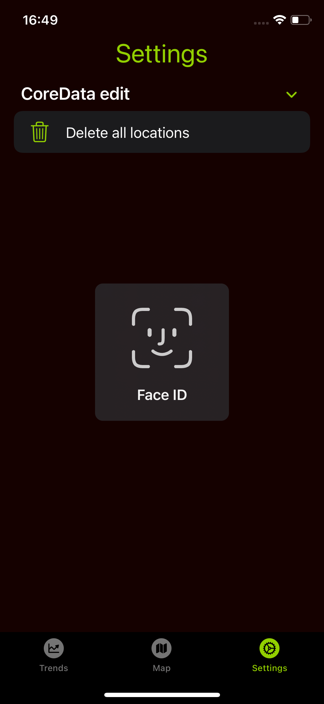
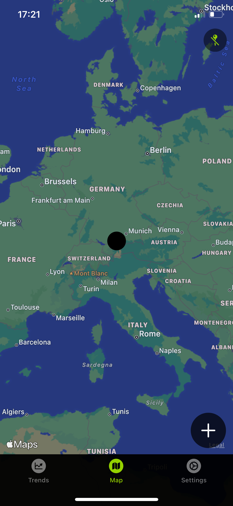
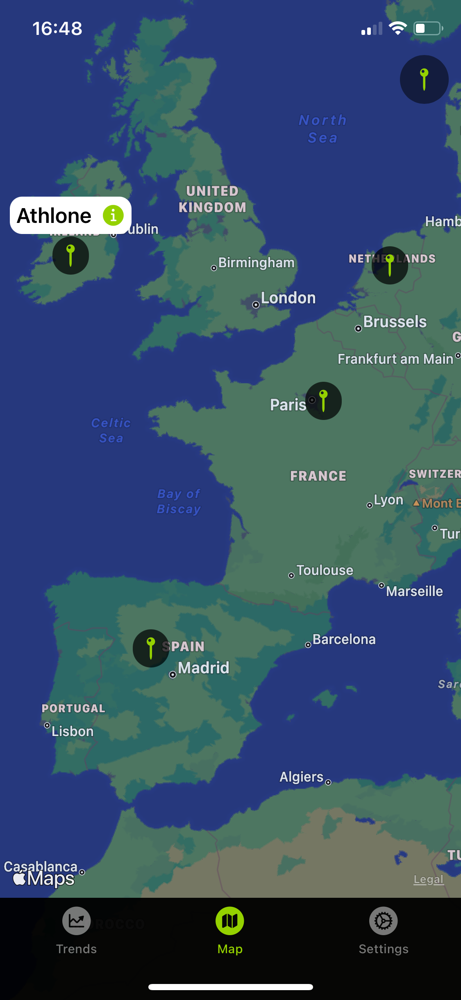

# iOS-MapTweet
iOS app - MapTweet. Created using SwiftUI.

<table>
<tr>
<td></td>
<td></td>
<td></td>
</tr>
<tr>
<td></td>
<td></td>
<td></td>
</tr>
</table>

SwiftUI app displaying hot topics (trending hashtags) based on user's preferred location.  Location can be selected by dropping map marker on preferred city and opening marker's detail View to retrieve closest matching location Twitter has data for. Location is added to Trends View list (saved in CoreData ORM) and by tapping on will retrieve top 10 trending hashtags of place's location from Twitter API. In case of no internet connection, warning message with haptic feedback is present. For removing all locations, proceed to Settings and use biometrics (FaceID, or TouchID).  

Target: iOS14  
Stack: SwiftUI, Async/Await, CoreData, MapKit, PhotosUI, LocalAuthentication  
Please update Protocols.swift with your Twitter API Bearer token.
